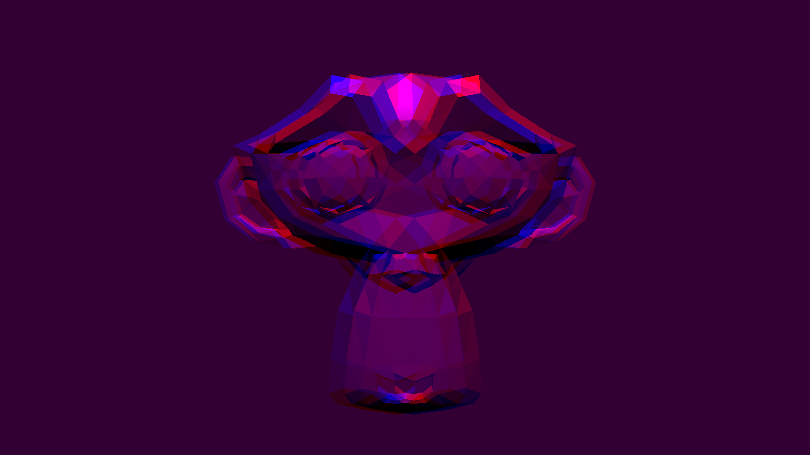

# Représentation des Données Visuelles 2020
#### Bled Nicolas / Zeyen Olivier

## Compilation

```sh
git clone https://github.com/zyno1/rdv_2020.git
cd rdv_2020
mkdir build
cd build
cmake ..
make
```


## Rendu final

* sans anaglyphe : 

`-i data/duck.obj --zoom 0.5 --normal`


`-i data/blender_monkey.obj --zoom 1.5 --normal`


* avec anaglyphe : 

`-i data/duck.obj --zoom 0.5`


`-i data/blender_monkey.obj --zoom 1.5`



